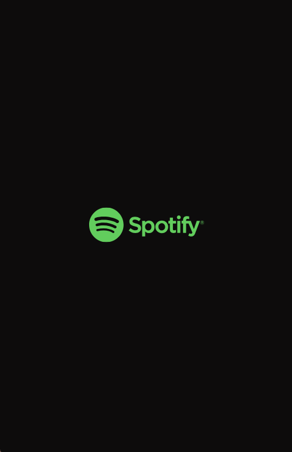
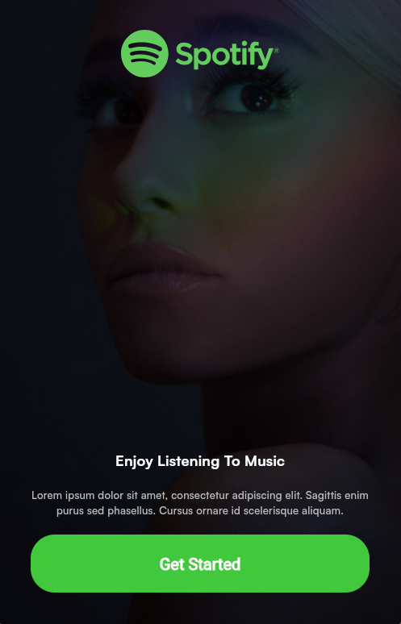

# spotify

A new Flutter project.

# Screenshots

## Splash screen

## Ger Started Screen

## Choose mode Screen

## Signup or signin Screen

## Getting Started

This project is a Spotify Clone app. 

A few resources to get you started if this is your first Flutter project:

- [Lab: Write your first Flutter app](https://docs.flutter.dev/get-started/codelab)
- [Cookbook: Useful Flutter samples](https://docs.flutter.dev/cookbook)

For help getting started with Flutter development, view the
[online documentation](https://docs.flutter.dev/), which offers tutorials,
samples, guidance on mobile development, and a full API reference.
